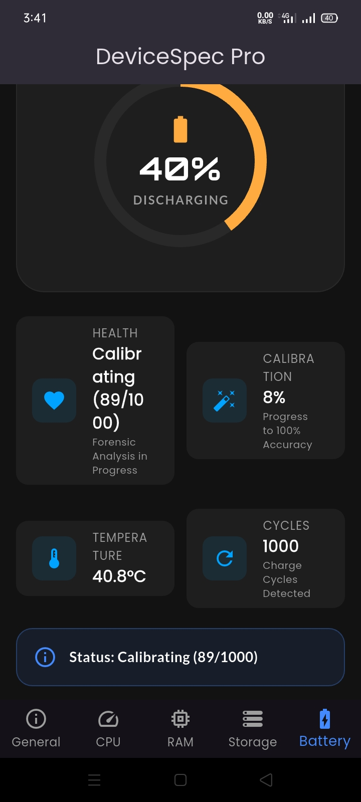
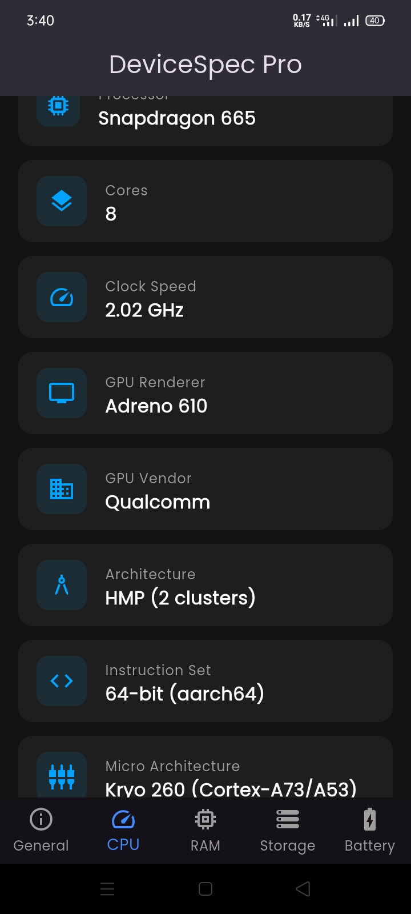
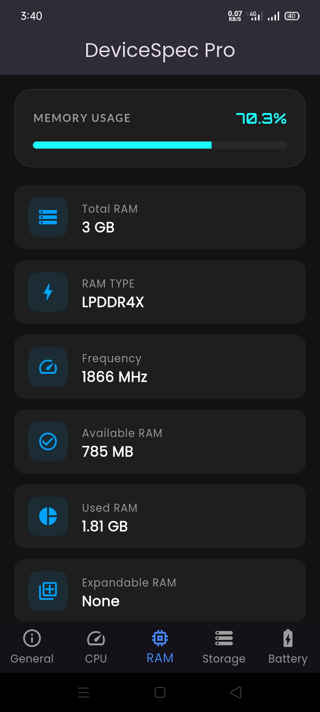
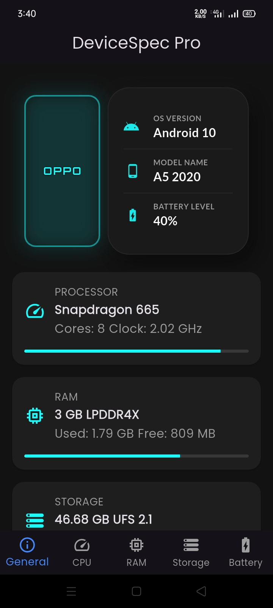

# 📱 DeviceSpec Pro
> **The Ultimate Hardware Forensic Tool for Android — Breaking the Android 14 Barrier!**

---

## 📸 App Preview

  
  
  

  
  

---

## ✨ Key Features (Unique Capabilities)

### 🔋 1. Legacy Battery Forensic
* **Cycle Count:** Extract real charge cycles even on Android 10, 11, 12, and 13.
* **Health Percentage:** View exact battery degradation stats.
* **Real-time Calibration:** Built-in engine to verify hardware reporting.

### 💾 2. Storage Chip Diagnostic
* **Lifespan Detection:** Check if your UFS or eMMC chip is dying (Anti-Lag check).
* **Manufacturer Info:** Identify if you have **Samsung, Micron, or SK Hynix** storage.

### ⚡ 3. Deep Hardware Probe
* **Native Speed:** Uses Kotlin Platform Channels (No slow Java overhead).
* **CPU Micro-architecture:** Identifies exact core types (Kryo, Cortex).

---

## 🛠 Tech Stack
* **Frontend:** Flutter (Dart)
* **Backend:** Kotlin (Native Android APIs)
* **Architecture:** Clean Modular UI

---

## 🚦 Project Status
Currently in **Active Development**. Source code will be released following the final stability testing. 🚀

---

Made with ❤️ for the Android Community | Star this Repo ⭐

